# Bamazon
Bamazon

* Customer Instructions
* The first should ask them the ID of the product they would like to buy.
   * The second message should ask how many units of the product they would like to buy.
   * If not, the app should log a phrase like `Insufficient quantity!`, and then prevent the order from going through.
   * If your store _does_ have enough of the product, you should fulfill the customer's order.
   * This means updating the SQL database to reflect the remaining quantity.
   * Once the update goes through, show the customer the total cost of their purchase.
   
* Manager Instructions
  * If a manager selects `View Products for Sale`, the app should list every available item: the item IDs, names, prices, and quantities.

  * If a manager selects `View Low Inventory`, then it should list all items with an inventory count lower than five.

  * If a manager selects `Add to Inventory`, your app should display a prompt that will let the manager "add more" of any item currently in the store.

  * If a manager selects `Add New Product`, it should allow the manager to add a completely new product to the store.
  
* Customer Screenshoots
  * Display Inventory
     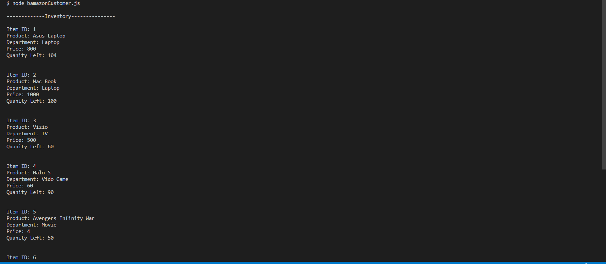
  * Buying Item
     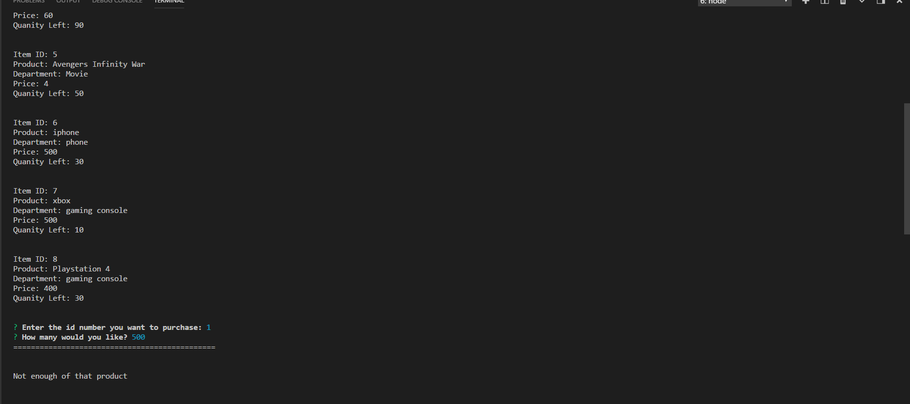
     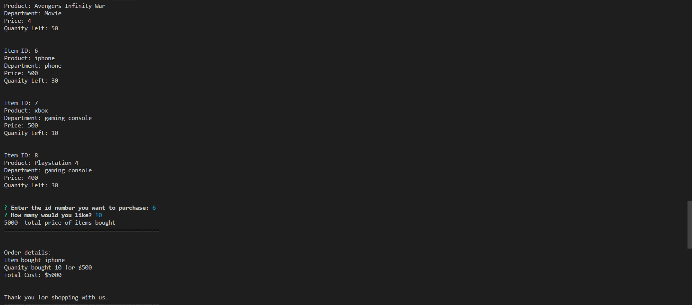
     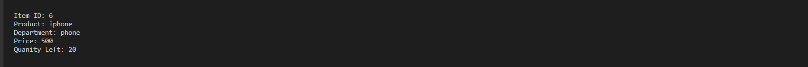
 
* Manager Screenshoots
  * Dispaly Inventory
     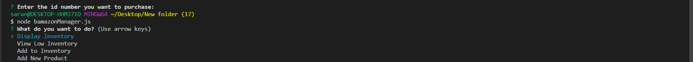
     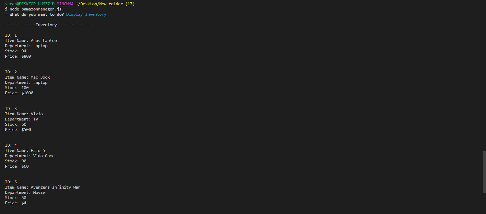
  * Check Low Inventory
     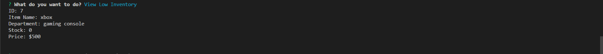
  * Add to Inventory
     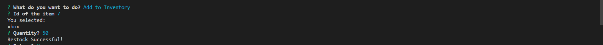
     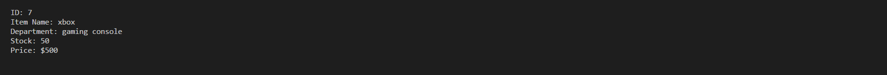
  * Add New Product
     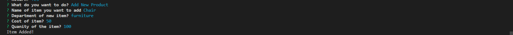
     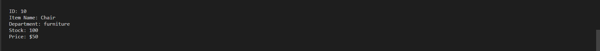
      
     
    
* Bamazon Customer GIFs
 

  
* Bamazon Manager GIFs
 

